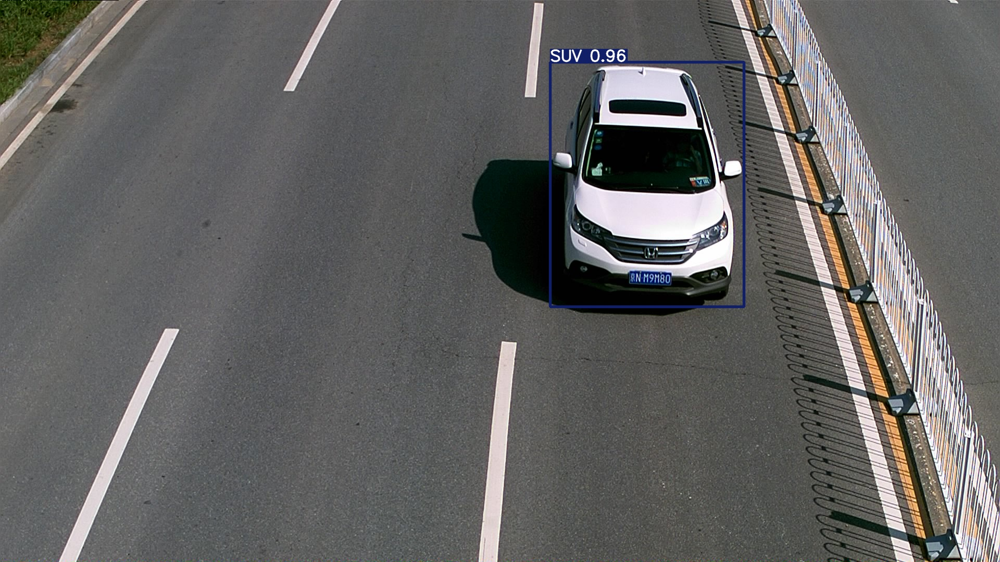

# 一、训练、验证

## 1.数据预处理

### (1)提取单独mat，并转换为yolo格式

`convert_annotation( './BITVehicle_Dataset/VehicleInfo.mat',  './BITVehicle_Dataset/images','./save_yolo_data')`

把VehicleInfo.mat（给的mat文件，把所有9850张图片的信息都汇总到一起了：

- 名称（name）：图像的文件名。
- 高度（height）：图像的高度。       宽度（width）：图像的宽度。
- 车辆数量（nvehicles）：图像中车辆的数量。
- 车辆（vehicles）：该字段是一个大小为1×nvehicles的结构体数组，每个元素描述一辆车。每个元素包含五个字段：左、上、右、下以及类别。前四个字段描述车辆在图像中的位置，“类别”字段代表车辆的类型。 ）

中的标签提取出来，将给的images和mat改成以下格式：

`save_yolo_data/` 

`├── images/` 

`│   ├── vehicle_0000001.jpg` 

`│   ├── vehicle_0000002.jpg` 

`│   └──……`

`├── labels/` 

`│   ├── vehicle_0000001.txt`

`│   ├── vehicle_0000002.txt`

`│   └──……`

其中，以vehicle_0000001.txt为例，其格式为：

4 [0.39895833] [0.15925926] [0.17604167] [0.31296296]：

- 4：“类别”字段代表车辆的类型，并将字符串和数字进行映射

- 后面四个参数为：

  - 将传统边界框 `(left, top, right, bottom)` 转换为 YOLO 的 `(x_center, y_center, w, h)` 格式，并归一化到 [0, 1]。

    ```python
    x_center = (left + right) / 2 / width	# 计算归一化的中心点横坐标
    y_center = (top + bottom) / 2 / height  # 计算归一化的中心点纵坐标
    w = (right - left) / width	# 计算归一化的目标框宽度
    h = (bottom - top) / height	# 计算归一化的目标框高度
    ```

```python
import scipy.io
import cv2
import os
import random
import shutil
import yaml

# 类别名称与数字映射关系
category_map = {
    'Bus': 0,
    'Microbus': 1,
    'Minivan': 2,
    'Sedan': 3,
    'SUV': 4,
    'Truck': 5
}

def convert_annotation(mat_file_path, images_dir, save_dir):
    # 加载.mat文件
    mat_data = scipy.io.loadmat(mat_file_path)
    vehicle_info = mat_data['VehicleInfo']

    # 创建存放YOLO注释和图像的目录
    images_save_dir = os.path.join(save_dir, 'images')  # 图像目录
    labels_save_dir = os.path.join(save_dir, 'labels')  # 标签目录

    if not os.path.exists(images_save_dir):
        os.makedirs(images_save_dir)

    if not os.path.exists(labels_save_dir):
        os.makedirs(labels_save_dir)

    # 遍历每一张图像的注释信息
    for i in range(vehicle_info.shape[0]):
        img_info = vehicle_info[i][0]
        img_name = img_info['name'][0]
        img_path = os.path.join(images_dir, img_name)

        # 获取图像的尺寸
        img = cv2.imread(img_path)
        height, width, _ = img.shape

        # 获取车辆信息
        vehicles = img_info['vehicles'][0]
        yolo_annotations = []

        for vehicle in vehicles:
            left = vehicle[0][0]
            top = vehicle[1][0]
            right = vehicle[2][0]
            bottom = vehicle[3][0]
            category_name = vehicle[4][0]  # 类别名称，例如 'Truck'

            # 获取数字类别ID
            category = category_map.get(category_name, -1)  # 如果没有找到类别，返回-1（表示无效）

            if category == -1:
                print(f"警告: 未找到类别 '{category_name}' 的映射")
                continue

            # 转换为YOLO格式
            x_center = (left + right) / 2 / width
            y_center = (top + bottom) / 2 / height
            w = (right - left) / width
            h = (bottom - top) / height

            yolo_annotations.append(f"{category} {x_center} {y_center} {w} {h}")

        # 保存YOLO格式的标签文件
        annotation_file = os.path.join(labels_save_dir, img_name.replace('.jpg', '.txt'))
        with open(annotation_file, 'w') as f:
            f.write('\n'.join(yolo_annotations))

        # 复制图像到目标目录
        shutil.copy(img_path, os.path.join(images_save_dir, img_name))

    print(f"图像保存至: {images_save_dir}")
    print(f"标签保存至: {labels_save_dir}")


if __name__ == "__main__":
    mat_file_path = './BITVehicle_Dataset/VehicleInfo.mat'
    images_dir = './BITVehicle_Dataset/images'
    save_dir = './save_yolo_data'  # 结果保存目录
    convert_annotation(mat_file_path, images_dir, save_dir)
```


### (2)分割训练集、验证集

`split_dataset( 'save_yolo_data/images' , 'save_yolo_data/labels',  './yolov5/train_data',  './yolov5/val_data' , split_ratio=0.8)`

 将保存为 YOLO 格式的目标检测数据集拆分为**训练集**和**验证集**，并将拆分后的数据存储在指定的文件夹中。

- 保存为 YOLO 格式的目标检测数据集：

  - `save_yolo_data/images`：图片文件目录

    `save_yolo_data/labels`：标签文件目录；每个图片对应一个 `.txt` 文件，记录了图片中的目标框信息（按 YOLO 格式）。

- 拆分为**训练集**和**验证集**：

  - **`./yolov5/train_data`**：**训练集**的文件夹路径。
    - 训练集的图片和对应的标签将被分别存储在 `train_data/images` 和 `train_data/labels` 
  - **`./yolov5/val_data`**：**验证集**的文件夹路径。
    - 验证集的图片和对应的标签将被分别存储在 `val_data/images` 和 `val_data/labels` 中。

- **`split_ratio=0.8`**

  - 表示数据集的划分比例。
  - **80%** 的图片和标签会被划分到训练集，剩下的 **20%** 会被划分到验证集。

**分割后的文件夹格式**：

`📂 yolov5`

`├── 📂 train_data`

`│   ├── 📂 images`

`│   │   ├── train_image1.jpg`

`│   │   ├── train_image2.jpg`

`│   │   ├── ...`

`│   ├── 📂 labels`

`│       ├── train_image1.txt`

`│       ├── train_image2.txt`

`│       ├── ...`

`├── 📂 val_data`

`│   ├── 📂 images`

`│   │   ├── val_image1.jpg`

`│   │   ├── val_image2.jpg`

`│   │   ├── ...`

`│   ├── 📂 labels`

`│       ├── val_image1.txt`

`│       ├── val_image2.txt`

`│       ├── ...`


```python
def split_dataset(image_dir, label_dir, train_dir, val_dir, split_ratio=0.8):
    # 获取所有图像文件名
    image_files = [f for f in os.listdir(image_dir) if f.endswith('.jpg')]

    # 打乱图像文件列表
    random.shuffle(image_files)

    # 计算训练集和验证集的数量
    total_images = len(image_files)
    train_size = int(total_images * split_ratio)

    # 划分训练集和验证集
    train_images = image_files[:train_size]
    val_images = image_files[train_size:]

    # 创建训练集和验证集文件夹
    os.makedirs(train_dir, exist_ok=True)
    os.makedirs(val_dir, exist_ok=True)

    # 创建训练集和验证集的图像和标签文件夹
    train_image_dir = os.path.join(train_dir, 'images')
    train_label_dir = os.path.join(train_dir, 'labels')
    val_image_dir = os.path.join(val_dir, 'images')
    val_label_dir = os.path.join(val_dir, 'labels')

    os.makedirs(train_image_dir, exist_ok=True)
    os.makedirs(train_label_dir, exist_ok=True)
    os.makedirs(val_image_dir, exist_ok=True)
    os.makedirs(val_label_dir, exist_ok=True)

    # 复制图像和标签到训练集和验证集文件夹
    for img_file in train_images:
        # 复制图像
        shutil.copy(os.path.join(image_dir, img_file), train_image_dir)
        # 复制对应的标签文件
        label_file = img_file.replace('.jpg', '.txt')
        shutil.copy(os.path.join(label_dir, label_file), train_label_dir)

    for img_file in val_images:
        # 复制图像
        shutil.copy(os.path.join(image_dir, img_file), val_image_dir)
        # 复制对应的标签文件
        label_file = img_file.replace('.jpg', '.txt')
        shutil.copy(os.path.join(label_dir, label_file), val_label_dir)

    print(f"Training set size: {len(train_images)}")
    print(f"Validation set size: {len(val_images)}")


if __name__ == "__main__":
    image_dir = 'save_yolo_data/images'  # 图像目录
    label_dir = 'save_yolo_data/labels'  # 标签目录（假设你已将标签文件存放在此）
    train_dir = './yolov5/train_data'  # 训练集文件夹
    val_dir = './yolov5/val_data'  # 验证集文件夹

    split_dataset(image_dir, label_dir, train_dir, val_dir, split_ratio=0.8)

```


### (3)创建 data.yaml配置文件

生成 YOLO 数据集的配置文件 `data.yaml`，以备 YOLOv5 训练。

包含了训练集、验证集路径、类别数量，以及每个类别的名称等关键信息。


创建完成的data.yaml文件内容如下：

> train: F:/yolov5/train_data/images
>
> val: F:/yolov5/val_data/images
>
> nc: 6
>
> names: ['Bus', 'Microbus', 'Minivan', 'Sedan', 'SUV', 'Truck']

```python
def create_data_yaml(train_path, val_path):
    # 类别名称
    class_names = ['Bus', 'Microbus', 'Minivan', 'Sedan', 'SUV', 'Truck']

    # 创建 data.yaml 配置文件
    data_yaml = {
        'train': os.path.join(train_path, 'images'),
        'val': os.path.join(val_path, 'images'),
        'nc': 6,  # 类别数
        'names': class_names  # 类别名称
    }

    # 保存 data.yaml 文件
    yaml_path = os.path.join('data.yaml')
    with open(yaml_path, 'w') as file:
        yaml.dump(data_yaml, file)

    print(f'data.yaml 配置文件已创建：{yaml_path}')
    
if __name__ == "__main__":
    train_dir = './yolov5/train_data'  # 训练集文件夹
    val_dir = './yolov5/val_data'  # 验证集文件夹
    
    # 创建 data.yaml 配置文件
    create_data_yaml(train_dir, val_dir)
```


## 2.训练yolov5模型

### (1) 训练**命令**：

`python train.py --img 640 --batch 4 --epochs 50 --data data.yaml --weights yolov5s.pt --workers 2 --cache=False`

### (2)**结果**：

**训练进度**

- **总完成 Epoch 数**：50
- **训练时长**：21.047 小时

**模型优化**

- **最终权重文件**：`runs/train/exp9/weights/last.pt`（大小：14.4MB）
- **最佳权重文件**：`runs/train/exp9/weights/best.pt`（大小：14.4MB）

**验证结果**

- **验证权重文件**：`runs/train/exp9/weights/best.pt`
- 模型摘要：
  - 层数：157
  - 参数：7,026,307
  - 梯度：0
  - GFLOPs：15.8

| **类别**                  | **图片数** | **实例数** | **精确率 (P)** | **召回率 (R)** | **mAP@0.5** | **mAP@0.5:0.95** |
| ------------------------- | ---------- | ---------- | -------------- | -------------- | ----------- | ---------------- |
| **所有类别**              | 1970       | 2009       | 0.956          | 0.964          | 0.981       | 0.954            |
| **Bus（公交车）**         | 1970       | 115        | 0.996          | 0.983          | 0.985       | 0.948            |
| **Microbus（小巴）**      | 1970       | 179        | 0.935          | 0.969          | 0.978       | 0.963            |
| **Minivan（小型货车）**   | 1970       | 106        | 0.925          | 0.938          | 0.976       | 0.939            |
| **Sedan（轿车）**         | 1970       | 1176       | 0.990          | 0.976          | 0.988       | 0.972            |
| **SUV（运动型多用途车）** | 1970       | 268        | 0.944          | 0.948          | 0.969       | 0.954            |
| **Truck（卡车）**         | 1970       | 165        | 0.947          | 0.970          | 0.991       | 0.949            |

更加详细的结果在：`runs/train/exp9`


### (3)验证命令

`python val.py --weights runs/train/exp9/weights/best.pt --data F:/yolov5/val_data.yaml --img 640 --iou 0.5 --save-txt --save-hybrid`

**①验证参数**

- **数据文件**：`F:/yolov5/val_data.yaml`
- **权重文件**：`runs/train/exp9/weights/best.pt`
- **Batch Size**：32
- **图像尺寸**：640
- **置信度阈值**：0.001
- **IoU 阈值**：0.5
- **最大检测数量**：300
- **任务**：验证（`val`）
- **设备**：CPU
- **FP16 精度**：`False`
- **DNN 模式**：`False`

> **注意**：启用 `--save-hybrid` 会返回基于混合标签的高 mAP，但不完全依赖预测。

**②模型信息**

- **YOLOv5 版本**：`v7.0-389-ge62a31b6`
- **Python 版本**：`3.11.2`
- **PyTorch 版本**：`2.5.1+cpu`
- **设备**：CPU
- 模型摘要：
  - 层数：157
  - 参数：7,026,307
  - 梯度：0
  - GFLOPs：15.8

**③数据扫描**

- 扫描文件夹：`F:\yolov5\val_data\labels.cache`
- **图像数量**：1970
- **背景图片**：0
- **损坏文件**：0

**④验证结果**

| **类别**                  | **图片数** | **实例数** | **精确率 (P)** | **召回率 (R)** | **mAP@0.5** | **mAP@0.5:0.95** |
| ------------------------- | ---------- | ---------- | -------------- | -------------- | ----------- | ---------------- |
| **所有类别**              | 1970       | 2009       | 1.000          | 0.994          | 0.992       | 0.992            |
| **Bus（公交车）**         | 1970       | 115        | 1.000          | 0.983          | 0.985       | 0.985            |
| **Microbus（小巴）**      | 1970       | 179        | 1.000          | 1.000          | 0.995       | 0.995            |
| **Minivan（小型货车）**   | 1970       | 106        | 1.000          | 1.000          | 0.995       | 0.995            |
| **Sedan（轿车）**         | 1970       | 1176       | 1.000          | 0.986          | 0.989       | 0.989            |
| **SUV（运动型多用途车）** | 1970       | 268        | 1.000          | 1.000          | 0.995       | 0.995            |
| **Truck（卡车）**         | 1970       | 165        | 1.000          | 0.994          | 0.995       | 0.995            |

**⑥速度**

- **预处理时间**：0.3ms/图片
- **推理时间**：27.5ms/图片
- **NMS 时间**：0.3ms/图片
- **输入形状**：`(32, 3, 640, 640)`

**⑦结果**

- **保存的结果目录**：`runs/val/exp2`
- **保存的标签文件**：`1970 labels`，路径：`runs/val/exp2/labels`


### (4)测试命令

`python detect.py --weights runs/train/exp9/weights/best.pt --img 640 --source ./val_data/images`

- 指定待检测的图片来自路径 `./val_data/images`；
- 逐一处理图片：显示每张图片的文件名、尺寸、检测出的物体类别和每张图片的推理时间。

> Fusing layers... 
> Model summary: 157 layers, 7026307 parameters, 0 gradients, 15.8 GFLOPs
> image 1/1970 F:\yolov5\val_data\images\vehicle_0000011.jpg: 384x640 1 Microbus, 62.2ms
> image 2/1970 F:\yolov5\val_data\images\vehicle_0000017.jpg: 384x640 1 Sedan, 47.6ms
> image 3/1970 F:\yolov5\val_data\images\vehicle_0000019.jpg: 384x640 1 Sedan, 55.4ms
> image 4/1970 F:\yolov5\val_data\images\vehicle_0000021.jpg: 384x640 1 Sedan, 53.3ms
> image 5/1970 F:\yolov5\val_data\images\vehicle_0000022.jpg: 384x640 1 Sedan, 48.5ms
>
> ……
>
> ……
>
> image 1967/1970 F:\yolov5\val_data\images\vehicle_0009817.jpg: 480x640 1 Truck, 67.1ms
> image 1968/1970 F:\yolov5\val_data\images\vehicle_0009823.jpg: 480x640 1 Truck, 74.1ms
> image 1969/1970 F:\yolov5\val_data\images\vehicle_0009840.jpg: 480x640 1 Truck, 64.4ms
> image 1970/1970 F:\yolov5\val_data\images\vehicle_0009846.jpg: 480x640 1 Truck, 69.1ms
> Speed: 1.1ms pre-process, 66.5ms inference, 0.7ms NMS per image at shape (1, 3, 640, 640)
> Results saved to runs\detect\exp2

- 检测的结果被保存在指定的目录 `runs/detect/exp2` 中：

  预测结果以图片方式保存（包括目标框、预测类型、预测概率）：以`vehicle_0000042.jpg`为例：

  

